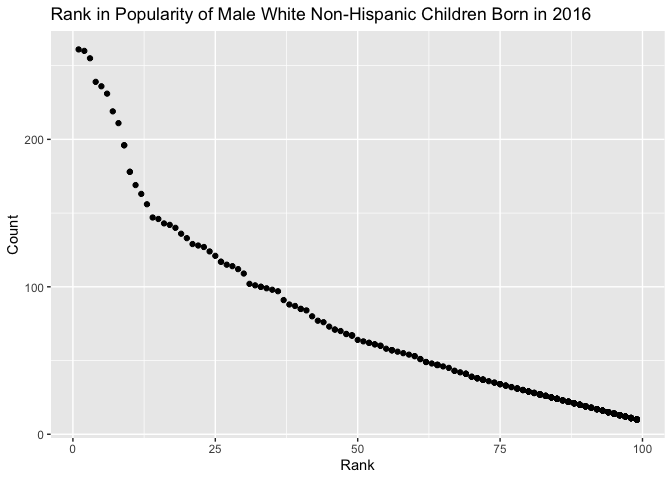

p8105\_hw2\_ps3070
================

First, I will load the `tidyverse` and `readxl` libraries.

``` r
library(tidyverse)
library(readxl)
```

PROBLEM 1
---------

To read and clean the Mr. Trash Wheel .xlsx file, I will:

-   import the data
-   specify the sheet in the Excel file
-   omit non-data entries
-   use reasonable variable names
-   omit rows that do not include dumpster-specific data
-   round the number of sports balls to the nearest integer and converts the result to an integer variable (using `as.integer`)

``` r
trashwheel = read_excel(
  "./data/Trash-Wheel-Collection-Totals-8-6-19.xlsx",
  sheet = "Mr. Trash Wheel",
  range = "A2:N408") %>%
  janitor::clean_names() %>% 
  drop_na(dumpster) %>% 
  mutate(sports_balls = as.integer(round(sports_balls, digits = 0)))
```

Only cells from A2 to N408 are imported because column O contains notes and row 1 only contains a figure and no data.

To clean up names of the data to snake case, I used `janitor::clean_names()`. The grand totals are included within the dataset. To omit rows that are not dumpster-specific, I omitted rows that included these grand totals. Under the row `dumpster`, I dropped any rows that were recorded as `NA` so that the grand total rows would be removed.

Next, I will read and clean the precipitation data, joining datasets for years 2017 and 2018. It should be noted that the 2018 precipitation data has empty rows, so I used `na.omit()` to avoid saving those rows.

``` r
precip_2017 = read_excel(
  "./data/Trash-Wheel-Collection-Totals-8-6-19.xlsx",
  sheet = 5,
  range = "A2:B14") %>% 
  janitor::clean_names() %>% 
  mutate(year = 2017)

precip_2018 = read_excel(
  "./data/Trash-Wheel-Collection-Totals-8-6-19.xlsx",
  sheet = 4,
  range = "A2:B14") %>% 
  janitor::clean_names() %>% 
  mutate(year = 2018) %>% 
  na.omit(total)

precip = bind_rows(precip_2017, precip_2018) %>% 
  janitor::clean_names() %>% 
  rename(precip_in = total) %>%
  mutate(month = month.name[month])
```

The Mr. Trash Wheel dataset contains several variables describing weight of dumpsters, content, and volume in a total of 344 rows (number of observations). Key variables include weight in tons, volume in cubic yards, contents (like plastic bottles, cigarette butts, and grocery bags), and homes powered from the waste-to-energy plant that uses the trash for electricity. Total precipitation in 2018 is 16.67 inches, and 70.33 inches in 2017. The median number of sports balls collected in 2017 was 8.

PROBLEM 2
---------

While importing `pols-month.csv`, I will clean it by doing the following:

-   separate `mon` into day, month, and year
-   replace month number with month name
-   create a `president` variable taking the values of `prez_gop` and `prez_dem`
-   remove `prez_gop`, `prez_dem`, and `day`

Columns `prez_gop` and `prez_dem` are removed and consolidated into the column `president`. A column `name` was created to indicate `prez_gop` or `prez_dem`, but it was removed as well because `president` already indicates `0` for `gop` and `1` for `dem`.

``` r
pols = read_csv(file = 
  "./data/pols-month.csv") %>% 
  separate(mon, c("year", "month", "day"), convert = TRUE) %>% 
  mutate(month = month.name[month]) %>% 
  pivot_longer(starts_with("prez"),
               values_to = "president") %>% 
  select(-day, -name) %>% 
  arrange(year, month) %>% 
  select(year, month, everything())
```

Below, I will import and clean `snp.csv` using similar guidelines.

``` r
snp = read_csv(file = 
  "./data/snp.csv") %>% 
  separate(date, c("day", "month", "year"), convert = TRUE) %>% 
  mutate(month = month.name[month]) %>% 
  select(-day) %>% 
  arrange(year, month) %>% 
  select(year, month, everything())
```

Now I will import and tidy the unemployment data.

``` r
unemp = read_csv(file = 
  "./data/unemployment.csv") %>% 
  pivot_longer(cols = Jan:Dec,
               names_to = "month",
               values_to = "rate_unemployed") %>% 
    mutate(month = month.name[match(month, month.abb)]) %>% 
    janitor::clean_names() %>%
    arrange(year, month) %>%
    select(year, month, everything())
```

Lastly, I will fully join the datasets by merging `snp` into `pols` and merging `unemployment` into the result. I also chose to organize it so that `year`, `month`, and `president` appear before other variables.

``` r
pols_snp_unemp =
  full_join(full_join(pols, snp, by = c("year", "month")), unemp, by = c("year", "month")) %>% 
  select(year, month, president, everything())
```

These datasets (and the final `pols_snp_unemp` dataset) include information about unemployment rates, election results, and S&P 500 closing numbers. The `pols` dataset indicated the party affiliation - Democratic (`dem`) or Republican (`gop`) - of people in different political offices in months from April 1947 to March 1988, with 1644 rows and 9 columns. The `snp` dataset showed closing values of the S&P 500 index from April 1950 to May 2015, with 787 rows and 3 columns. The `unemp` dataset contained unemployment rates per month from January 1948 to December 2015, 816 rows and 3 columns. Even though the date ranges of each dataset are not the same (some contain data for more time frames than others), the final datasets combines these datasets. The final dataset `pols_snp_unemp` contains 2788 rows and 11 columns.

PROBLEM 3
---------

First, I will load and tidy the data with the following in mind:

-   names of a categorical predictor and the case structure of string variables changed over time
-   some rows seem duplicated, so I removed using `distinct()`

After recoding, I removed duplicates because it looks like some of the same counts were recorded within other corresponding values of ethnicity (i.e. `BLACK NON HISP` vs `BLACK NON HISPANIC`) were overlapping counts or separate counts. Thus, I removed duplicates after recoding corresponding values as the same value.

This code chunk tidies the data and creates two reader-friendly tables: One showing rankings of the name "Olivia" from 2011 - 2016 within different ethnicity categories, and one showing the most popular male baby names per year (in the same range) within each ethnicity category.

``` r
baby_names = read_csv(file = "./data/Popular_Baby_Names.csv") %>% 
  janitor::clean_names() %>% 
  mutate(
    ethnicity = str_to_lower(ethnicity),
    gender = str_to_lower(gender),
    childs_first_name = str_to_lower(childs_first_name),
    ethnicity = recode(ethnicity, "asian and paci" = "asian and pacific islander",
                       "black non hisp" = "black non hispanic",
                       "white non hisp" = "white non hispanic")) %>% 
  group_by(ethnicity) %>% 
  distinct(.keep_all = FALSE)

baby_names_olivia =
  filter(baby_names, childs_first_name == "olivia") %>% 
  select(-count, -gender,-childs_first_name) %>% 
  pivot_wider(names_from = "year_of_birth",
    values_from = "rank"
  )

baby_names_male =
  filter(baby_names, gender == "male", rank == "1") %>% 
  select(-count, -rank, -gender) %>% 
  pivot_wider(
    names_from = "year_of_birth",
    values_from = "childs_first_name"
  ) 
```

Below, I printed the two tables.

``` r
knitr::kable(baby_names_olivia, format = "html", caption = "Popularity of Olivia as a Female Baby Name")
```

<table>
<caption>
Popularity of Olivia as a Female Baby Name
</caption>
<thead>
<tr>
<th style="text-align:left;">
ethnicity
</th>
<th style="text-align:right;">
2016
</th>
<th style="text-align:right;">
2015
</th>
<th style="text-align:right;">
2014
</th>
<th style="text-align:right;">
2013
</th>
<th style="text-align:right;">
2012
</th>
<th style="text-align:right;">
2011
</th>
</tr>
</thead>
<tbody>
<tr>
<td style="text-align:left;">
asian and pacific islander
</td>
<td style="text-align:right;">
1
</td>
<td style="text-align:right;">
1
</td>
<td style="text-align:right;">
1
</td>
<td style="text-align:right;">
3
</td>
<td style="text-align:right;">
3
</td>
<td style="text-align:right;">
4
</td>
</tr>
<tr>
<td style="text-align:left;">
black non hispanic
</td>
<td style="text-align:right;">
8
</td>
<td style="text-align:right;">
4
</td>
<td style="text-align:right;">
8
</td>
<td style="text-align:right;">
6
</td>
<td style="text-align:right;">
8
</td>
<td style="text-align:right;">
10
</td>
</tr>
<tr>
<td style="text-align:left;">
hispanic
</td>
<td style="text-align:right;">
13
</td>
<td style="text-align:right;">
16
</td>
<td style="text-align:right;">
16
</td>
<td style="text-align:right;">
22
</td>
<td style="text-align:right;">
22
</td>
<td style="text-align:right;">
18
</td>
</tr>
<tr>
<td style="text-align:left;">
white non hispanic
</td>
<td style="text-align:right;">
1
</td>
<td style="text-align:right;">
1
</td>
<td style="text-align:right;">
1
</td>
<td style="text-align:right;">
1
</td>
<td style="text-align:right;">
4
</td>
<td style="text-align:right;">
2
</td>
</tr>
</tbody>
</table>
``` r
knitr::kable(baby_names_male, format = "html", caption = "Most Popular Male Baby Names")
```

<table>
<caption>
Most Popular Male Baby Names
</caption>
<thead>
<tr>
<th style="text-align:left;">
ethnicity
</th>
<th style="text-align:left;">
2016
</th>
<th style="text-align:left;">
2015
</th>
<th style="text-align:left;">
2014
</th>
<th style="text-align:left;">
2013
</th>
<th style="text-align:left;">
2012
</th>
<th style="text-align:left;">
2011
</th>
</tr>
</thead>
<tbody>
<tr>
<td style="text-align:left;">
asian and pacific islander
</td>
<td style="text-align:left;">
ethan
</td>
<td style="text-align:left;">
jayden
</td>
<td style="text-align:left;">
jayden
</td>
<td style="text-align:left;">
jayden
</td>
<td style="text-align:left;">
ryan
</td>
<td style="text-align:left;">
ethan
</td>
</tr>
<tr>
<td style="text-align:left;">
black non hispanic
</td>
<td style="text-align:left;">
noah
</td>
<td style="text-align:left;">
noah
</td>
<td style="text-align:left;">
ethan
</td>
<td style="text-align:left;">
ethan
</td>
<td style="text-align:left;">
jayden
</td>
<td style="text-align:left;">
jayden
</td>
</tr>
<tr>
<td style="text-align:left;">
hispanic
</td>
<td style="text-align:left;">
liam
</td>
<td style="text-align:left;">
liam
</td>
<td style="text-align:left;">
liam
</td>
<td style="text-align:left;">
jayden
</td>
<td style="text-align:left;">
jayden
</td>
<td style="text-align:left;">
jayden
</td>
</tr>
<tr>
<td style="text-align:left;">
white non hispanic
</td>
<td style="text-align:left;">
joseph
</td>
<td style="text-align:left;">
david
</td>
<td style="text-align:left;">
joseph
</td>
<td style="text-align:left;">
david
</td>
<td style="text-align:left;">
joseph
</td>
<td style="text-align:left;">
michael
</td>
</tr>
</tbody>
</table>
Lastly, I created a scatterplot showing the rank in popularity of a name (x-axis) versus the count per name (y-axis) among white, male, non-hispanic children born in 2016.

``` r
scatter_male =
  baby_names %>% 
  filter(gender == "male",
         ethnicity == "white non hispanic",
         year_of_birth == "2016") %>% 
  ggplot(aes(x = rank, y = count)) +
  geom_point() + 
  labs(
    title = "Rank in Popularity of Male White Non-Hispanic Children Born in 2016",
    x = "Rank",
    y = "Count"
  )

print(scatter_male)
```


